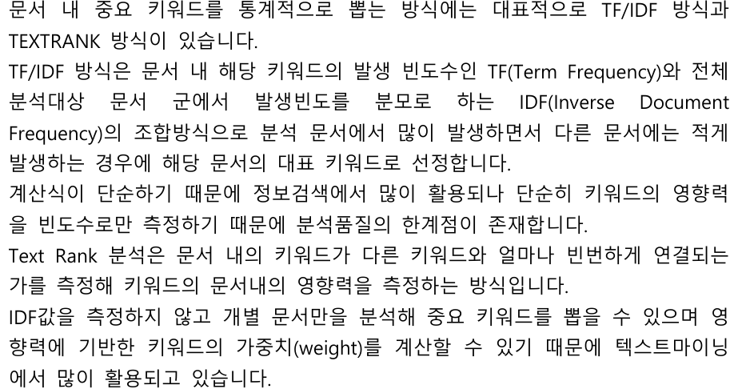

### 알고리즘 개요
```bash
1. TF-IDF (Term Frequency – Inverse Document Frequency)
의미: 자주 등장하지만 전체 문서에는 드물게 등장하는 단어에 높은 점수를 줌.

역할: KDC 그룹 내에서 중요한 단어를 수치화함.

2. TextRank
의미: 단어 간 연결 관계를 기반으로 중요한 단어를 추출하는 그래프 알고리즘.

역할: 자주 함께 등장하는 단어 쌍을 중심으로 중심성 높은 단어를 추출.

3. TF-IDF × TextRank 결합
아이디어: 각 단어의 "빈도 기반 중요도(TFIDF)"와 "연결 기반 중심성(TextRank)"을 곱하여 더 강력한 특징어 선정.

장점: 단순 빈도/구조 기반 한계 극복. "의미론적으로 중요한 단어 + 문맥상 중심어"의 교집합 추출 가능.
```

## TF-IDF
TF (Term Frequency): 해당 단어가 문서에 얼마나 자주 등장?
IDF (Inverse Document Frequency): 여러 문서에 흔하지 않을수록 중요

## Co-occurrence 그래프 구축(TextRank 전처리)
1. TextRank란? 단어들을 그래프의 노드로 놓고 공동으로 등장하는 단어들 간 간선(edge) 연결
2. 이 그래프에서 PageRank 알고리즘 적용 -> 중심성 높은 단어 = 중요 키워드
3. 두 단어가 근접해서 등장하면 연결 -> window_size=2
4. TextRank 점수 계산 -> 간선의 가중치를 기반으로 PageRank 방식으로 점수 계산, 공동 등장 빈도가 많고 중심에 가까운 단어에 높은 점수를 줌
5. TF-IDF × TextRank 결합 -> 교집합 단어에 대해서만 결합 점수 계산, TF-IDF 점수 × TextRank 점수


